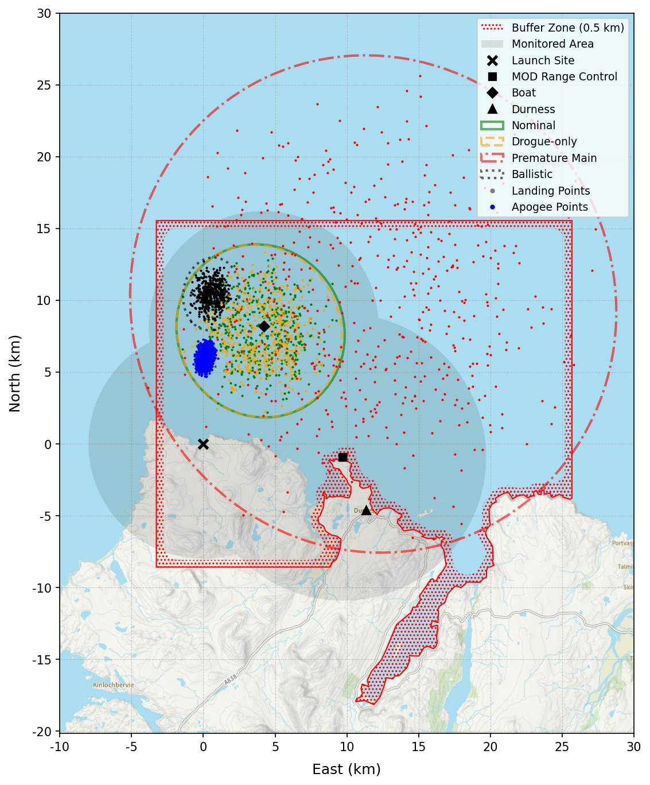
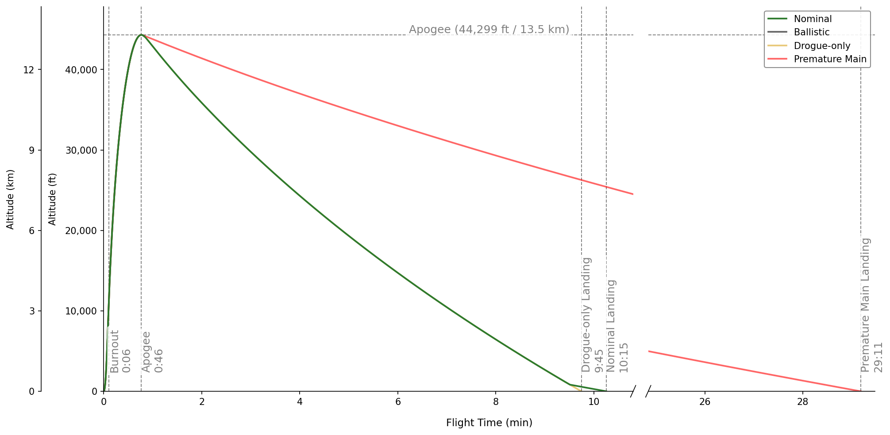
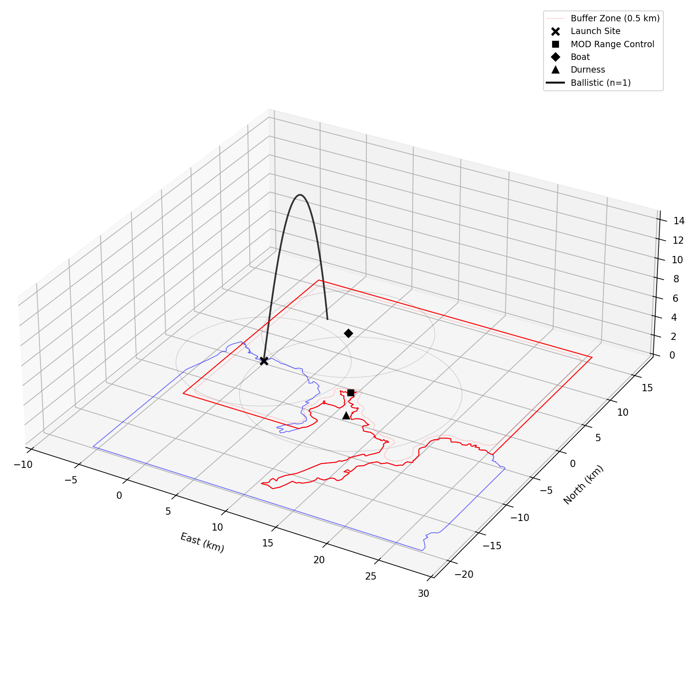
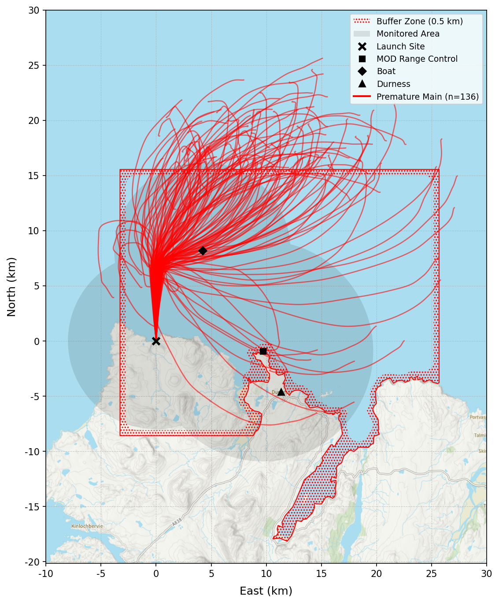
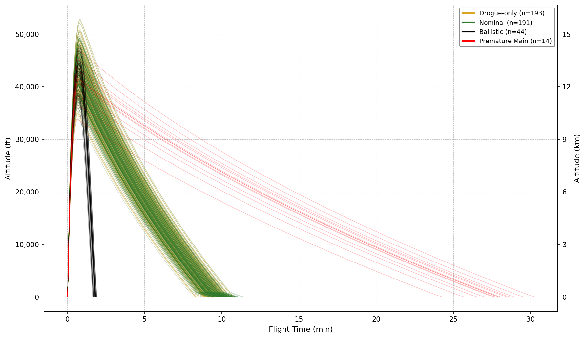
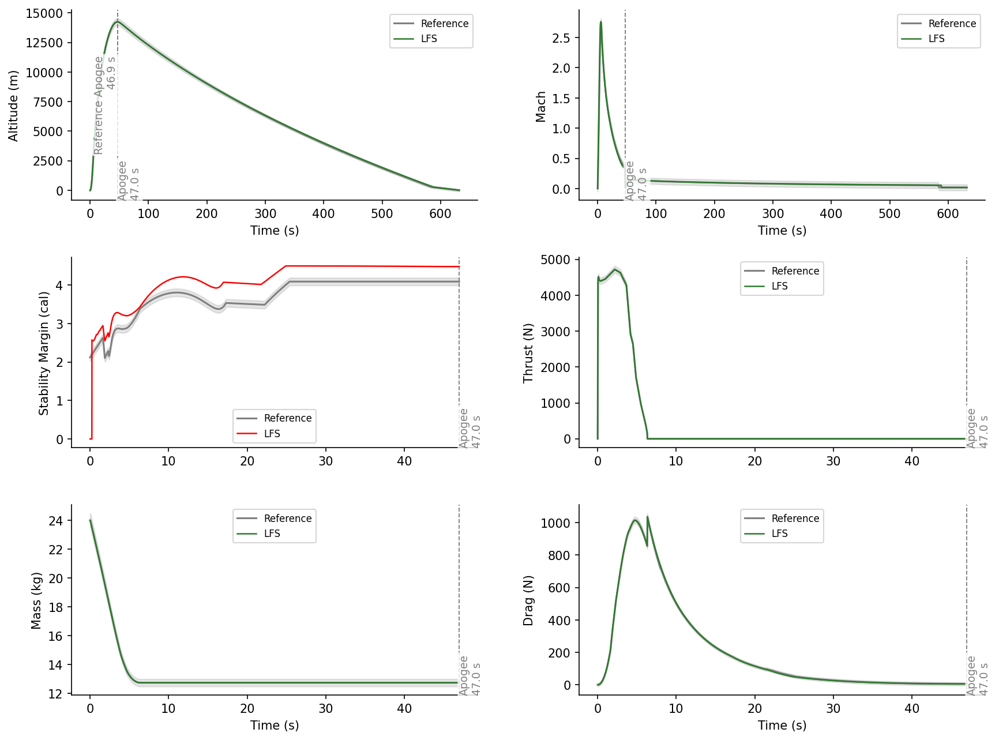

# Leeds Flight Simulator (LFS)

A six-degree-of-freedom Monte Carlo flight simulator for single-stage, passively stabilised, axisymmetric sounding rockets. Generates flight safety analysis evidence suitable for a CAA large rocket permission safety case under Article 96 of the Air Navigation Order 2016.

The simulator covers launch rail exit to landing, evaluating up to four descent scenarios and checking trajectory containment, coastline compliance, monitor coverage, and aerodynamic stability against configurable acceptance criteria. Launch azimuth and inclination can be automatically optimised when set to `"auto"`.

Runs entirely offline. The only network access is to fetch base map tiles for the dispersion plot, which are cached locally after the first download.

---

## Table Of Contents

- [Background](#background)
- [Installation](#installation)
- [Quick Start](#quick-start)
- [Usage](#usage)
- [Key Concepts](#key-concepts)
- [Input Files](#input-files)
- [Acceptance Criteria](#acceptance-criteria)
- [Optimisation](#optimisation)
- [Integrator Tolerances](#integrator-tolerances)
- [Output Files](#output-files)
- [Replaying Samples](#replaying-samples)
- [Verification](#verification)
- [Damping Assessment](#damping-assessment)
- [Operational Workflow](#operational-workflow)
- [Contact](#contact)
- [Licence](#licence)
- [References](#references)

---

## Background

Originally developed for the Gryphon II Block II (G2B2) launch by the Leeds University Rocketry Association (LURA) — a supersonic sounding rocket targeting the UKRA amateur altitude record, launching from Cape Wrath, Scotland.

> **G2B2 Safety Case:** [https://leedsrocketry.co.uk/g2b2-safety-case](https://leedsrocketry.co.uk/g2b2-safety-case)
> <!-- TODO: Confirm URL -->

Although built for G2B2, the simulator is entirely generic. Any team launching a passively stabilised, axisymmetric rocket under a CAA permission (or similar regulatory framework) can use it by supplying their own configuration files.


## Installation

**Prerequisites:** Python 3.10+

```
git clone https://github.com/leedsrocketry/leeds-flight-simulator.git
cd leeds-flight-simulator
pip install numpy numba scipy shapely pyyaml ruamel.yaml matplotlib rich click
```

Verify:

```
python . --help
```


## Quick Start

```
python . run ../simulations/cases/g2b2-cape-wrath/config.yaml
```

The simulator loads the configuration, runs verification (if configured), runs optimisation (if azimuth or inclination is `"auto"`), then executes the Monte Carlo analysis across all active descent scenarios. Progress bars update in the terminal, each showing an inline PASS/FAIL result as they complete. Warnings accumulate in a yellow-bordered panel.

Results are saved to `../simulations/cases/g2b2-cape-wrath/results/`.


## Usage

All commands are run from inside the project directory.

### Running A Simulation

```
python . run <simulation.yaml>
```

**Flags:**

| Flag | Effect |
|------|--------|
| `-q`, `--no-popup` | Save figures to disk instead of displaying interactively |
| `-p`, `--points` | Overlay individual apogee and landing scatter points on the dispersion plot |
| `--no-termination` | Disable early termination on stability and AoA violations (all samples run to completion) |

Example:

```
python . run ../simulations/cases/g2b2-cape-wrath/config.yaml -q
```

### Replaying Samples

Replay a specific sample:

```
python . replay ../simulations/cases/g2b2-cape-wrath/results/summary.yaml --scenario nominal --sample 117
```

Replay all non-compliant samples from a completed run:

```
python . replay ../simulations/cases/g2b2-cape-wrath/results/summary.yaml --non-compliant
```

Filter to a single scenario, a specific violation reason, or both — flags combine naturally:

```
python . replay ../simulations/cases/g2b2-cape-wrath/results/summary.yaml --non-compliant --scenario ballistic
python . replay ../simulations/cases/g2b2-cape-wrath/results/summary.yaml --non-compliant --reason stability
python . replay ../simulations/cases/g2b2-cape-wrath/results/summary.yaml --non-compliant --scenario drogue_only --reason footprint
python . replay ../simulations/cases/g2b2-cape-wrath/results/summary.yaml --compliant --scenario nominal
```

Valid reason keywords:

| Keyword | Violation |
|---------|-----------|
| `footprint` | Trajectory exited the buffered danger area |
| `ceiling` | Apogee above the buffered altitude ceiling |
| `stability` | Static margin below minimum |
| `coastline` | Landing point is at sea |
| `monitor` | Landing outside the monitored area |

**Flags:**

| Flag | Effect |
|------|--------|
| `--seed INTEGER` | Override master seed |
| `--scenario NAME` | Scenario name (`nominal`, `ballistic`, `drogue_only`, `premature_main`). Required with `--sample`; optional filter for `--compliant` / `--non-compliant` |
| `--sample INTEGER` | Sample index (requires `--scenario`) |
| `--non-compliant` | Replay all non-compliant samples |
| `--reason KEYWORD` | Filter `--non-compliant` by violation type; repeatable (see above) |
| `--compliant` | Replay all compliant samples |
| `-q`, `--no-popup` | Save figures to disk instead of displaying interactively |


## Key Concepts

### Monte Carlo Analysis

Rather than simulating a single trajectory, the simulator runs many trajectories with randomised conditions — different wind profiles, motor impulse, launch rail alignment, and fin cant — producing a cloud of landing points. The `compliance_threshold` in `simulation.yaml` determines whether the flight is safe.

### Descent Scenarios

Every sample is simulated with the full 6DoF model from rail exit. For parachute scenarios, the 6DoF integrator runs to apogee, then a 3DoF point-mass descent model takes over — the vehicle is treated as a point mass descending at terminal velocity under its parachute drag, adopting the local wind vector at each altitude. For the ballistic scenario, the 6DoF integrator continues all the way to ground impact — no model switch occurs. At apogee, the sample follows one of up to four descent branches:

| Scenario | Description | Significance |
|----------|-------------|--------------|
| `nominal` | Drogue at apogee (if present), main at deployment altitude | Expected case |
| `ballistic` | No parachutes | Worst-case impact energy, minimal drift |
| `drogue_only` | Drogue deploys, main fails | Moderate drift, high descent rate |
| `premature_main` | Main opens at apogee | Maximum drift — bounding case for containment |

Which scenarios are active depends on the vehicle's recovery configuration:

| Recovery Config | `nominal` | `ballistic` | `drogue_only` | `premature_main` |
|-----------------|-----------|-------------|---------------|-----------------|
| Both, `main.threshold` numeric | ✅ | ✅ | ✅ | ✅ |
| Both, `main.threshold` = `"apogee"` | ✅ | ✅ | ✅ | -- |
| Main only, `main.threshold` numeric | ✅ | ✅ | -- | ✅ |
| Main only, `main.threshold` = `"apogee"` | ✅ | ✅ | -- | -- |
| No parachutes | ✅ | -- | -- | -- |

`premature_main` is suppressed when `main.threshold = "apogee"` because apogee deployment is already the earliest possible — no earlier failure mode exists.

Scenarios listed in `coastline_check_scenarios` or `monitor_check_scenarios` that are not active for the current vehicle are silently skipped with a warning.

### Wind Profiles

The `wind_profiles` field in `simulation.yaml` can point to either a single `.npz` file or a directory of `.npz` files:

- **Single file** — one analysis run using this wind ensemble.
- **Directory** — the full analysis runs independently for each `.npz` file, with output in sub-folders named after each profile (e.g. `results/day1/`, `results/day2/`). This allows a multi-day wind campaign to be assessed in a single invocation.

The simulator has no knowledge of how the profiles were generated; all source-specific logic (EarthGRAM, GFS, ECMWF, radiosonde, perturbation modelling) is handled by [windgen](https://github.com/leedsrocketry/windgen). Each `.npz` file must contain:

**Wind components use the "blowing towards" convention.** Positive `wind_east_ms` means wind blowing towards east; positive `wind_north_ms` means wind blowing towards north. This matches the standard meteorological u/v component convention used by GFS, ECMWF, and EarthGRAM.

| Array Key | Shape | Description |
|-----------|-------|-------------|
| `altitude_m` | `(M,)` | Altitude grid in metres AGL, monotonically increasing |
| `wind_east_ms` | `(N, M)` | Eastward wind component per profile (m/s, positive = blowing towards east) |
| `wind_north_ms` | `(N, M)` | Northward wind component per profile (m/s, positive = blowing towards north) |

`N` must be >= `samples` under `monte_carlo` in `simulation.yaml`. Sample `i` uses profile `i`.

### Surface Wind Override

When a `surface_wind` sub-section is present under `launch` in `simulation.yaml`, a user-specified surface wind replaces the lower portion of each wind profile. The override blends linearly into the profile wind between ground level and `blend_height_m`. Omit the section entirely to disable. Useful on launch day when you have an anemometer reading at the pad but are using forecast or balloon data for the upper atmosphere.

**`bearing_deg` is the direction the wind is blowing towards** (its heading), measured in degrees clockwise from north. A bearing of 0° means wind blowing towards north; 90° means wind blowing towards east. This is consistent with the `wind_east_ms`/`wind_north_ms` component convention described above.


## Input Files

Example input files are provided in `../simulations/cases/g2b2-cape-wrath/`. The values in those files are justified in the G2B2 safety case (see [Background](#background)).

### `simulation.yaml`

Main simulation configuration. All file paths are resolved relative to the directory containing the simulation YAML. See `../simulations/cases/g2b2-cape-wrath/config.yaml` for a fully annotated example with comments for every parameter.

Key sections:

| Section | Purpose |
|---------|---------|
| `vehicle` | Path to `vehicle.yaml` |
| `site` | Launch site coordinates, danger area, coastline, monitor stations, map markers, altitude ceiling |
| `launch` | Rail geometry, azimuth/inclination (or `"auto"`), wind profiles, surface wind override |
| `monte_carlo` | Sample count, seed, uncertainties (1σ), acceptance criteria |
| `verification` | Optional reference trajectory comparison (see [Verification](#verification)) |
| `rtol`, `atol` | Optional integrator tolerances (see [Integrator Tolerances](#integrator-tolerances)) |

### `vehicle.yaml`

Defines the vehicle's physical properties. All dimensions are in mm (with `_mm` suffix), masses in kg (`_kg`), inertias in kg·m² (`_kg_m2`). CG is measured from the nosecone tip. Dry mass properties are derived automatically from the wet properties and motor geometry. LFS converts mm to metres internally at the parsing boundary.

Top-level fields:

| Field | Description |
|-------|-------------|
| `motor` | Path to RASP `.eng` thrust curve file |
| `aero_tables` | Path to aero CSV directory (or single file) |
| `fins_aero_table` | Optional path to a specific fins component CSV, overriding the file matched by name from the aero tables directory |
| `body_diameter_mm` | Overall body diameter [mm] |
| `nozzle_diameter_mm` | Nozzle exit diameter [mm] |
| `rasaero` | RASAero-specific properties (pyrasaero reads; LFS ignores) |

The `components` section defines the vehicle geometry ordered forward-to-aft. Each sub-section (nosecone, body_tube, boattail, fins) contains that component's dimensions.

Derived quantities:

- **Total length:** Sum of component lengths (nosecone + body_tube + boattail; fins contribute 0)
- **Reference area:** A_ref = π · d² / 4 (same convention as RASAero)
- **Fin CP radius:** `body_diameter / 2 + fin_span / 2` — distance from longitudinal axis to fin mid-span
- **Nozzle position:** Assumed at the aft end (= total length); the motor is flush-mounted
- **Motor CG:** Derived from the `.eng` file header: `total_length − motor_length / 2`. Stays fixed during the burn (inside-out burn model).
- **Propellant inertias:** Derived from the annular cross-section geometry (see below).

#### Optional motor geometry fields

Two optional fields in the `mass` section refine the propellant inertia model:

| Field | Default | Effect |
|-------|---------|--------|
| `propellant_outer_diameter_mm` | motor diameter | Propellant grain outer diameter [mm]. Accounts for casing, liner, and insulator thickness. |
| `propellant_inner_diameter_mm` | 0 (solid cylinder) | Propellant bore diameter [mm]. Defines the inner radius of the propellant annulus. |

A warning is emitted when either field is omitted, since the default assumptions (solid cylinder, full motor diameter) underestimate propellant roll inertia for hollow-grain motors.

#### Motor inertia model

Propellant is modelled as an annular cylinder with outer radius `r_o` and initial inner radius `r_i`:

- `r_o = propellant_outer_diameter / 2`  (defaults to `motor_diameter / 2` if omitted)
- `r_i = propellant_inner_diameter / 2`

Initial propellant inertias (used to derive dry vehicle inertias from the user-supplied wet values):

- **Roll:** `I_roll = ½ m (r_o² + r_i²)`
- **Lateral** (about propellant CG): `I_lat = m (3(r_o² + r_i²) + L²) / 12`

During the burn the propellant burns radially outward from the bore. The inner radius grows as mass is consumed:

```
r_i(t) = sqrt( r_o² − f(t) · (r_o² − r_i₀²) )
```

where `f(t) = m_prop(t) / m_prop₀` is the remaining mass fraction. Propellant inertias are recomputed from the current annular geometry at each integration timestep, rather than scaled linearly with mass fraction. This correctly captures the increasing specific inertia of the remaining propellant as it sits at progressively larger radii.

The parallel-axis theorem transfers the dry and propellant contributions to the instantaneous vehicle CG at each timestep.

See `../simulations/vehicles/g2b2/g2b2-o3400.yaml` for a fully annotated example.

### Motor File (`.eng`)

Standard RASP/RockSim `.eng` file. Downloadable from [thrustcurve.org](https://www.thrustcurve.org) for most certified motors. Referenced from `vehicle.yaml`. The `.eng` header provides the motor's outer diameter, length, propellant mass, and total mass — all used to derive motor CG and propellant inertias automatically.

### Aerodynamic Tables

The `aero_tables` field in `vehicle.yaml` can point to either a single `.csv` file or a directory of `.csv` files:

- **Single file** — whole-vehicle mode. Per-component forces, pitch/yaw damping, and roll are disabled. A warning is issued.
- **Directory** — one `.csv` per aerodynamic component (nosecone, body tube, fin set, boattail, etc.), enabling full 6-DoF with per-component restoring forces, analytical pitch/yaw damping, and roll torques.

Each `.csv` must use one of two column layouts. CP_m is in metres from the nosecone tip. The grid need not be uniformly spaced.

- **8-column** (recommended): `Mach, Reynolds, AoA_deg, CA_off, CA_on, CN, CP_m, CN_alpha_per_rad` — includes the normal force derivative per radian, used for analytical damping computation.
- **7-column**: `Mach, Reynolds, AoA_deg, CA_off, CA_on, CN, CP_m` — `CA_off` and `CA_on` are the axial force coefficients for motor-off and motor-on respectively. `CN_alpha_per_rad` is set to NaN (damping uses finite-difference fallback).

#### Base Drag and Power-On/Off Switching

The axial force coefficient CA depends on whether the motor is burning. When the motor fires, exhaust flow from the nozzle fills the low-pressure wake at the rocket's base, reducing base drag. Aerodynamic data sources typically report two values: **CA Power-Off** (motor not burning) and **CA Power-On** (motor burning).

LFS reads both CA columns from each aero table CSV, sums them independently across components into two vehicle-level tables, and selects the appropriate table at each timestep based on whether the current time is before or after motor burnout. This applies to both the launch rail and free-flight phases.

Vehicle-level switching is physically correct for the axial force: unlike the normal force (which must be resolved per-component to capture the correct moment arms for pitch/yaw damping), the axial force acts along the body axis and produces no pitch/yaw moment regardless of where along the body it acts. The total vehicle-level CA is therefore all that is needed.

#### Per-Component Force Model and Pitch/Yaw Damping

When aero tables are provided as a directory of per-component CSVs, LFS computes normal forces and moments per component to capture both the restoring moment and pitch/yaw damping.

**Restoring forces** are computed by looking up each component's C_N and C_P at the **vehicle (bulk) angle of attack**. This is physically correct because the source aerodynamic code (e.g. RASAero II) computes all components simultaneously at a common vehicle AoA. The per-component values derived by differencing cumulative assemblies encode inter-component interference (wake effects, upwash/downwash) at whole-vehicle flow conditions — not isolated component response to a local angle. Querying these tables at a per-component local AoA would ask the table a question it was never designed to answer.

**Pitch/yaw damping** is computed analytically using the Mandell linearised damping formula. When the rocket pitches at rate *q*, each component at position X\_CP\_j experiences a crossflow perturbation δα\_j = q × (X\_CP\_j − X\_CG) / V. The resulting damping moment is:

    δτ = −0.5 × ρ × V × A_ref × q × Σ_j C_Nα_j × (X_CP_j − X_CG)²

For a statically stable rocket the net sum is dominated by fin surfaces (large positive C\_Nα, large lever arm) and the damping is stabilising — it opposes the angular rate. Components with negative C\_Nα (e.g. boattails) contribute anti-damping; the sign of the net effect depends on the vehicle design.

The formulation requires only the per-component C\_Nα and C\_P at the current flight condition (Mach, Reynolds) — no re-query of the aero tables at a different angle. The linearised approximation is accurate for sounding rockets where angle of attack remains within a few degrees (well within the linear C\_Nα regime).

Damping quantities are only computed and plotted from **rail exit to apogee**. During the rail phase, the vehicle is contrained and airspeed is too low for aerodynamic forces to be meaningful — the corrective moment coefficient C\_1 (proportional to V²) approaches zero while jet damping C\_{2R} (proportional to mass flow rate, independent of airspeed) remains finite. This causes the damping ratio ζ = C\_2 / (2√(C\_1 · I)) to diverge mathematically, which is an artefact of the linearised formulation rather than a physical instability.

> **Note for RASAero II users:** RASAero applies the power-on/off base drag correction at the vehicle level, not per-component. When per-component data is extracted via successive differencing ([pyrasaero](https://github.com/leedsrocketry/pyrasaero)), the power-on/off delta appears only on one component in the subtraction chain. This is expected — once per-component CAs are summed back to a vehicle total, the correct vehicle-level values are recovered. LFS is agnostic to the source of aerodynamic data (RASAero, CFD, wind tunnel, etc.) — the same format is used regardless of provenance.

### `danger_area.geojson`

A GeoJSON polygon defining the danger area footprint. **Coordinates are `[longitude, latitude]` per the GeoJSON spec.**

Useful tools:
- [NATS AIP](http://www.nats.aero/ais/aip) — for tracing danger area boundaries from official charts
- [geojson.io](https://geojson.io) — for drawing and editing polygons

### `coastline.geojson`

Optional. A GeoJSON polygon delineating the **on-land** area. The compliance check direction is set by `coastline_mode` under `site` in `simulation.yaml`:

| `coastline_mode` | Pass Condition |
|-----------------|----------------|
| `"sea"` | Landing point is **outside** the polygon (at sea) |
| `"land"` | Landing point is **inside** the polygon (on land) |

Omit the `coastline` key from `simulation.yaml` to disable the check entirely.


## Acceptance Criteria

A sample is compliant if **all** of the following hold:

1. **Stability margin** — checked during ascent only (up to apogee). Whenever AoA < 5° (hardcoded threshold that excludes rail-exit and apogee transients): static margin ≥ `sm_subsonic_min` calibres below Mach 0.91, or ≥ `sm_supersonic_min` calibres at or above it. Violation terminates the sample immediately; no descent phase is run. Maximum AoA is recorded but is not an acceptance criterion.
2. **Containment** — landing point inside the buffered danger area and peak altitude below the buffered altitude ceiling.
3. **Coastline** — if a coastline file is provided, the landing point must satisfy the configured `coastline_mode`.
4. **Monitor coverage** — landing within the configured radius of at least one monitor station. Applied only to scenarios listed in `monitor_check_scenarios`.

A run passes if ≥ `compliance_threshold` fraction of samples are compliant. All active scenario runs must pass.


## Optimisation

When `azimuth` and/or `inclination` are set to `"auto"`, the optimisation routine runs before the main Monte Carlo analysis:

1. **Inclination Selection.** Deterministic 6DoF simulations at each integer inclination in `inclination_range` (no wind). Selects the steepest inclination (maximising apogee) whose ballistic landing is both outside `ballistic_exclusion_radius` from the launch site and inside the buffered danger area.

2. **Azimuth Narrowing.** Analytically filters integer azimuths in `azimuth_range` using mean wind drift, discarding any whose estimated premature-main landing centroid falls outside the buffered danger area.

3. **Azimuth Optimisation.** Bayesian optimisation (Gaussian Process, UCB acquisition) over surviving azimuths. Each iteration runs premature-main Monte Carlo simulations with wind uncertainty to estimate containment probability.

4. **Candidate Validation.** Top candidate azimuths validated with the full uncertainty set (wind, impulse, launch angles, fin cant). Selects the azimuth with the greatest containment margin.

If only inclination is `"auto"`, only step 1 runs. If only azimuth is `"auto"`, steps 2–4 run with the provided inclination.


## Integrator Tolerances

The 6DoF trajectory integrator uses a Dormand-Prince RK4(5) adaptive step-size scheme. At each step, the local truncation error is estimated and the step is accepted when:

```
error <= atol + rtol * |state|
```

Two optional top-level fields in `simulation.yaml` control the accuracy/speed trade-off:

| Field | Default | Description |
|-------|---------|-------------|
| `rtol` | `1e-4` | Relative tolerance — error limit as a fraction of the state magnitude. Controls accuracy for large values (e.g. altitude at 10,000 m, velocity at 300 m/s). |
| `atol` | `1e-8` | Absolute tolerance — fixed error floor in state units. Prevents the stepper from taking excessively large steps when state values pass through zero (e.g. vertical velocity at apogee, angular rates during smooth flight). |

### How the defaults were chosen

The 13-element state vector contains positions (metres), velocities (m/s), quaternion components (~1), and angular rates (rad/s). The dominant cost is the number of accepted steps — tighter tolerances force smaller steps and longer runtimes.

`rtol=1e-4` gives 0.01% relative accuracy per step: at 10,000 m altitude, the per-step position error is bounded to ~1 m, which the global error accumulates far less than across the full trajectory. This is well within the percent-level tolerance bands used for verification against external simulators.

`atol=1e-8` is a tight absolute floor that ensures near-zero quantities (angular rates during stable flight, velocity components at apogee) still receive fine resolution. Without this, the integrator could take large steps through zero-crossings where the relative tolerance alone provides no constraint.

This combination is standard for aerospace trajectory simulation of short-duration flights (seconds to minutes). Orbital mechanics codes typically use much tighter values (`1e-12`) because they integrate over hours to days, but sounding rocket flights are too short for per-step errors at the `1e-4` level to accumulate meaningfully.

### Choosing your own values

1. Run the verification command with the default tolerances:
   ```
   python . verify config.yaml -q
   ```
2. Confirm all quantities pass within their tolerance bands.
3. To speed up the Monte Carlo (at the cost of accuracy), try loosening `rtol` by one order of magnitude (e.g. `1e-3`). Re-run verification to check.
4. To increase accuracy (at the cost of runtime), tighten `rtol` (e.g. `1e-5` or `1e-6`).
5. `atol` rarely needs changing. Only increase it if you observe the integrator taking unnecessarily small steps near zero-crossings. Decreasing it below `1e-8` has negligible effect.

As a rule of thumb, the Monte Carlo runtime scales roughly linearly with `1/rtol` — halving `rtol` approximately doubles the number of integration steps.


## Output Files

Results are saved to `results/`, relative to the directory containing `simulation.yaml`. The directory is cleared at the start of each run.

| File | Contents |
|------|----------|
| `summary.yaml` | Run metadata, warnings, per-scenario statistics (compliant/non-compliant counts, pass/fail, apogee and landing distance ranges), optimisation diagnostics (if applicable) |
| `samples.csv` | One row per sample — stochastic inputs, flight time, per-check compliance flags, aerodynamic extremes, and landing/apogee coordinates |
| `dispersion_plot.png` | Landing dispersion map (only when `-q` is used; see below) |
| `altitude_plot.png` | Mean altitude profile for each scenario (only when `-q` is used; see below) |
| `damping.png` | Damping ratio, natural frequency, and corrective/damping moment coefficients vs. time (only when `-q` is used; generated if per-component aero tables are loaded) |
| `damping_breakdown.png` | Per-component C1 and C2A breakdown vs. time (only when `-q` is used; generated if per-component aero tables are loaded) |
| `verification_plot.png` | Reference trajectory comparison (only when `-q` is used) |

### Dispersion Plot



Landing points colour-coded by descent scenario, overlaid on an OS Maps base map with the danger area, buffer boundary, coastline, monitor station coverage circles, map markers, and launch site.

### Altitude Plot



Mean altitude profile vs. time for each active descent scenario.


## Replaying Samples

Every sample is deterministic given the master seed, scenario name, and sample index. No full trajectory data is stored — any sample can be replayed exactly from these three values.

Replay displays figures interactively by default. Pass `-q` to save them to disk instead. If multiple samples are replayed, all trajectories are overlaid on the same figures:

1. **3D Isometric** — trajectory in NED space with the map overlaid on the ground plane, matching the dispersion plot style. Coloured by descent scenario; pink if terminated early due to a stability or AoA violation.
2. **Plan View** — same as above, viewed from directly above.
3. **Altitude vs. Time** — full flight from rail exit to landing.
4. **Angle of Attack vs. Time** — AoA profile over the flight.
5. **Roll Rate vs. Time** — roll rate history, with peak roll rate annotated.

The 3D isometric view shows the full trajectory from rail exit through descent, with the danger area and coastline projected onto the ground plane:



The plan view provides a top-down perspective for checking lateral dispersion against the danger area boundary:



The altitude-time plot shows the complete flight profile, highlighting the transition between ascent and descent phases:




## Verification

Before relying on the simulator for a safety case, verify it against an independent tool.

### Unit Tests

```
python -m pytest test/
```

Checks ISA against published tables, quaternion maths, launch rail exit velocity, terminal descent, aero interpolation and per-component analytical damping, the `.eng` parser, AoA computation, and wind `.npz` loading.

### Trajectory Comparison Tool

An optional single-trajectory comparison against an external flight simulator. Add a `verification` section to `simulation.yaml` with a reference `.csv` path and per-quantity tolerance bands. The reference `.csv` must contain a time column and at least one of: altitude, Mach, stability margin, thrust, mass, drag, CD, CG, CP. Column names are matched case-insensitively; missing columns are skipped.

> **Note:** The reference CSV is assumed to use SI units (metres, seconds, calibres). There is no unit sanitisation and no check that both simulators used the same input parameters — ensure your reference data is in SI and that vehicle, motor, and atmospheric inputs match before running verification.

```
python . verify <simulation.yaml>
```

**Flags:**

| Flag | Effect |
|------|--------|
| `-i`, `--inclination` `FLOAT` | Launch rail inclination (degrees); overrides config value |
| `-q`, `--no-popup` | Save figure to `results/verification_plot.png` instead of displaying interactively |
| `--dump-csv PATH` | Write per-timestep comparison data (reference, simulator, and error for each quantity) to a CSV file |

The inclination can be set at three levels, with later entries taking precedence:

1. `launch.rail.inclination` in the simulation config (uses the midpoint of `inclination_range` if set to `"auto"`)
2. `verification.inclination` in the simulation config (optional)
3. `-i` CLI flag (highest priority)

Example:

```
python . verify ../simulations/cases/g2b2-cape-wrath/config.yaml -i 85
python . verify ../simulations/cases/g2b2-cape-wrath/config.yaml --dump-csv debug/verify_comparison.csv -q
```

#### Acceptance

Each compared quantity is checked against its configured fractional tolerance band. A quantity passes if the fraction of comparison points outside the band is within the `exceedance_fraction` threshold.

Stability margin, thrust, mass, and drag force are compared over the **ascent phase only** (up to LFS apogee). Descent-phase values for these quantities are physically meaningless (no aerodynamic stability under parachute, no thrust, constant mass) and are excluded from both the comparison and the plot. Altitude and Mach are compared over the full flight.

CD, CG, and CP are compared over the full flight and included in the CSV dump but are not plotted.

The overall verification result passes if every compared quantity passes.

#### Comparison Figure

By default, the comparison figure is displayed interactively. Pass `-q` to save to file instead.



Six time-series subplots in a 3×2 grid. The top row (altitude, Mach) shows the full flight from launch to landing. The bottom four (stability margin, thrust, mass, drag force) show the ascent phase only, trimmed to apogee. Reference data is plotted in grey with fractional tolerance bands; the LFS output is overlaid in green (pass) or red (fail). LFS apogee time is marked on all subplots as a grey dashed vertical line; the reference apogee time is additionally marked on the altitude subplot.

#### CSV Dump

When `--dump-csv` is used, a CSV file is written with columns for each compared quantity: `ref_{qty}`, `lfs_{qty}`, `err_{qty}`. The time column uses the longest (full-flight) time base; ascent-only quantities have empty cells after apogee.


## Damping Assessment

Run a single mean-wind nominal trajectory and assess pitch/yaw damping:

```
python . damping <simulation.yaml>
```

**Flags:**

| Flag | Effect |
|------|--------|
| `-q`, `--no-popup` | Save figures to disk instead of displaying interactively |

Produces two plots:

1. **Damping plot** (`damping.png`) — corrective moment coefficient C1, total damping coefficient C2 (aerodynamic C2A + jet damping C2R), damping ratio zeta, and natural frequency, all vs. time from rail exit to apogee.
2. **Damping breakdown** (`damping_breakdown.png`) — per-component contributions to C1 and C2A, showing which components drive stability and which contribute anti-damping.

Damping quantities are computed from rail exit to apogee only. During the rail phase the vehicle is constrained and airspeed is too low for aerodynamic moments to be meaningful.

Damping plots are also generated automatically during `run` when per-component aero tables are loaded, using the nominal baseline trajectory.

Example:

```
python . damping ../simulations/cases/g2b2-cape-wrath/config.yaml -q
```


## Operational Workflow

A typical campaign uses the simulator at three stages:

1. **Safety Case (Months Before)** — Run with climatological wind profiles representing the full spread of weather for the planned launch month. This forms the basis for the safety case submitted to the CAA.

2. **Operations Planning (Days Before)** — Run with forecast-derived wind profiles (GFS, ECMWF, or similar). If the analysis fails, conditions may not be suitable for launch.

3. **Launch Day Go/No-Go (Hours Before)** — Run with radiosonde-derived wind profiles from the launch site. Enable the surface wind override with the current anemometer reading. The launch director uses this result alongside all other go/no-go criteria to make the final call. Re-run with fresh data if conditions change.


## Related Tools

| Tool | Purpose |
|------|---------|
| [pyrasaero](https://github.com/leedsrocketry/pyrasaero) | Automates RASAero II to export aeroplot data and converts it to LFS-compatible per-component aero tables |
| [windgen](https://github.com/leedsrocketry/windgen) | Generates the wind profile `.npz` ensembles that LFS reads as Monte Carlo wind input |


## Contact

For questions, bug reports, or contributions:
- **Toby Thomson** — el21tbt@leeds.ac.uk, me@tobythomson.co.uk
- **LURA Team** — launch@leedsrocketry.co.uk


## Licence

<!-- TODO: Add licence information -->


## References

- Mandell, G. K., Caporaso, G., and Bengen, W. P. (1973). *Topics in Advanced Model Rocketry*. MIT Press.
- Barrowman, J. S. (1967). *The Practical Calculation of the Aerodynamic Characteristics of Slender Finned Vehicles*. MSc thesis, The Catholic University of America.
- Niskanen, S. (2009). *Development of an Open Source model rocket simulation software*. MSc thesis, Helsinki University of Technology.
- Zipfel, P. H. (2014). *Modeling and Simulation of Aerospace Vehicle Dynamics*, 3rd ed. AIAA.
- Dormand, J. R. and Prince, P. J. (1980). A family of embedded Runge-Kutta formulae. *Journal of Computational and Applied Mathematics*, 6(1), 19–26.
